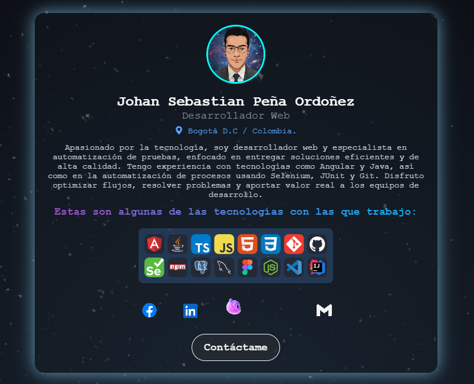

<h2 align="center">  <strong>Sebastian Peña — Desarrollador</strong></h2>

	
	

---

### 👋 ¡Hola! Soy Sebastián

Desarrollador web y automatizador de pruebas con un fuerte enfoque en **calidad**, **eficiencia** y **mejora continua**. Me apasiona construir soluciones escalables y trabajar en entornos colaborativos.

🔹 **Frontend & Backend**: Angular + Java  
🔹 **QA Automation**: Selenium, JUnit  
🔹 **Metodologías Ágiles**: SCRUM  
🔹 **Trabajo en equipo y aprendizaje constante**

---

## 📌 ¿Qué hice en este proyecto?

Diseñé una tarjeta de presentación personal utilizando solo **HTML y CSS** con enfoque visual moderno y accesible.  

🔹 Cree una estructura HTML semántica con mi nombre, rol, ubicación, descripción y tecnologías.  
🔹 Añadí una imagen de perfil animada (GIF) con estilo redondeado.  
🔹 Usé estilos en modo oscuro y detalles visuales como sombras, bordes y colores contrastantes.  
🔹 Integré enlaces sociales (GitHub, LinkedIn, Instagram, Facebook) con íconos GIF animados.  
🔹 Apliqué `Flexbox` para centrar todo vertical y horizontalmente.  
🔹 Separé el CSS en un archivo externo para mejor organización y reutilización.

Este proyecto demuestra mi capacidad para construir interfaces limpias, responsivas y con atención al detalle visual.

---

### 🖼️ Vista previa del proyecto

  

---

  <h3>
    
  Contactame
  </h3>

 

   &nbsp;&nbsp;
  
   &nbsp;&nbsp;
  
   &nbsp;&nbsp;
  
   &nbsp;&nbsp;
  
   &nbsp;&nbsp;  
  

  :heart_eyes: Thanks for watching my profile! Have a nice day! :wink:  
  &copy; 2025 Johan Sebastian Peña Ordoñez

 

 
  
	
  

 💡La mejora continua no es una opción, es parte del código.

 

---
